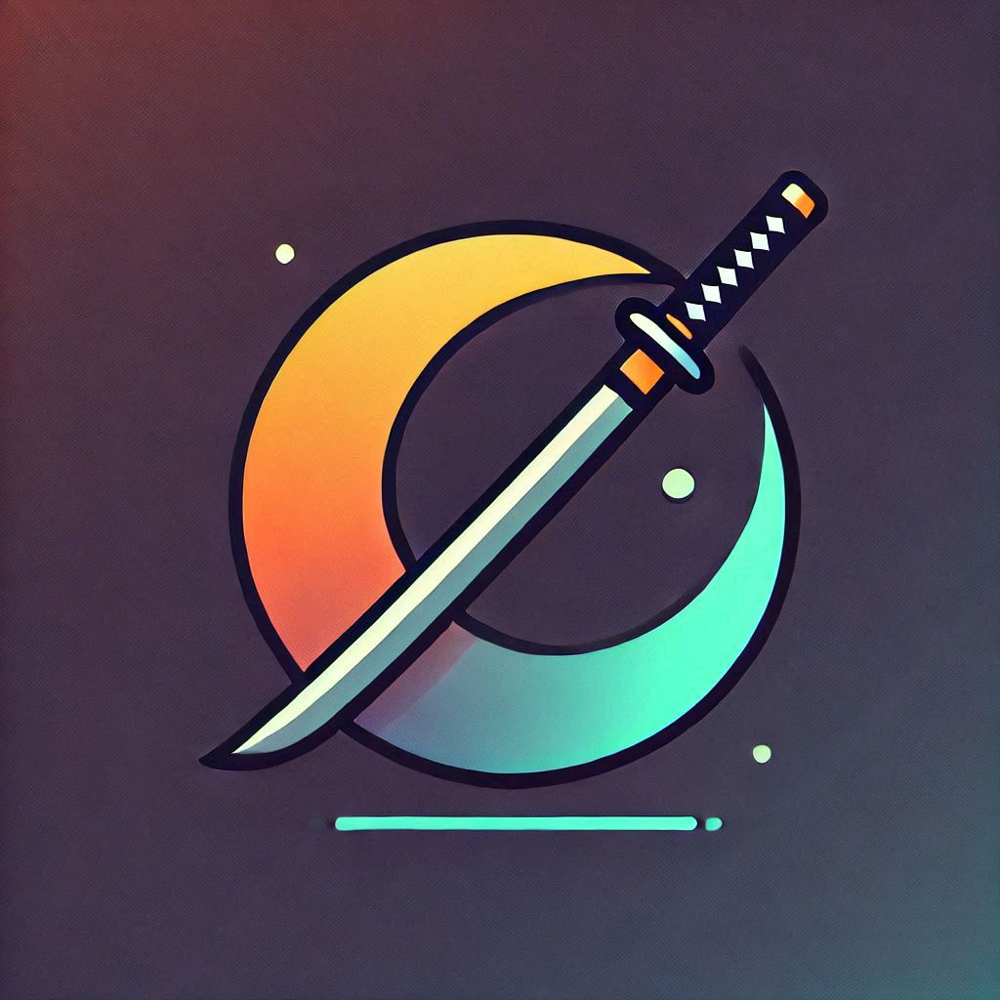
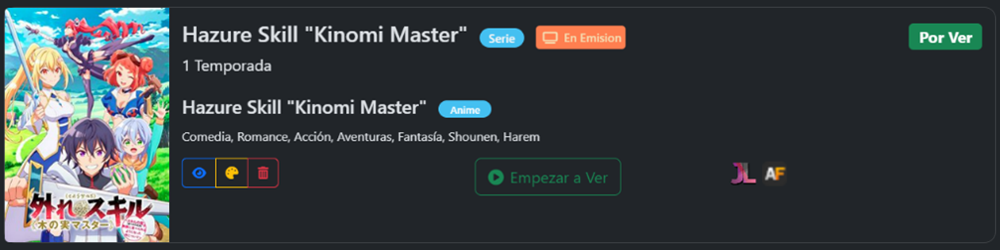
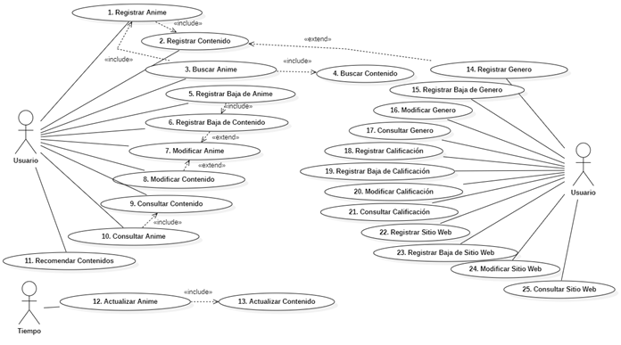
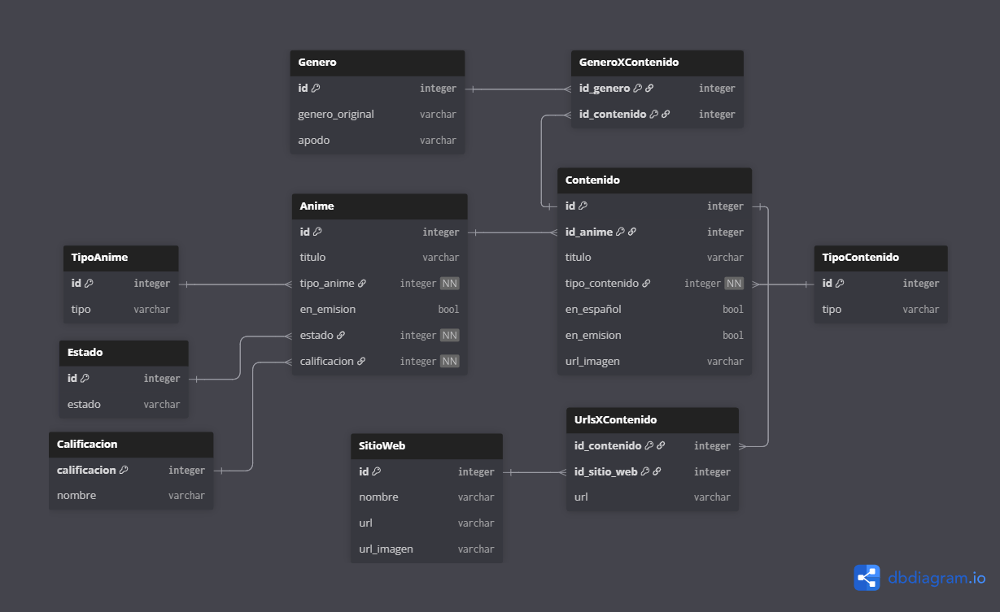
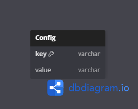

<h1 style="
  font-size:3em;
  font-weight:bold;
  background: linear-gradient(180deg, #FCD152 0%, #D8695C 36%, #64748D 67%, #6CFFD2 100%);
  -webkit-background-clip: text;
  -webkit-text-fill-color: transparent;
  margin-bottom: 0.2em;
">
AniVerse
</h1>

アニ・べルセ

---

## 🎯 Objetivo  
Facilitar la visualización y el registro de animes de las páginas **AnimeFLV**, **AnimeJL**, **Anime-ninja** y **Crunchiroll**. Permitiendo listar y calificar los animes vistos, facilitando las estadísticas de los gustos del usuario.

---

## 📌 ¿Qué va a hacer la app?  
Se va a encargar de buscar todo el contenido relacionado a un anime, mediante su nombre, ordenando según el orden cronológico. Listara todos los animes que el usuario registro para ver, asi como los que ha visto, está viendo en dicho momento o desee volver a ver. También se encargará de semanalmente mantener actualizados todos los animes al momento, en caso de nuevas temporadas o películas. Facilitará la muestra de estadísticas interesantes como la cantidad de animes vistos o registrados, asi como también la cantidad de animes por calificación e incluso los géneros que más le gustaron al usuario. Además, proporcionara una lista de posibles animes que le podrían gustar, basado en las preferencias del usuario obtenidas mediante el uso.
 Incluso permitirá la modificación de los contenidos de cada anime según el gusto del usuario, en caso de que a este no le convenza la decisión de la app. Asi como también, la manipulación del nombre otorgado a los géneros o las calificaciones posibles. Permitiendo la mayor personalización de la app, a los gustos de cada usuario.

---

## 💡 ¿Por qué deberían usar la app?  
Porque la aplicación permitirá el registro y calificación de los animes vistos. Es decir, permitirá registrar los animes, que el usuario vio, de una manera sencilla para que el usuario pueda estar enterado, en todo momento, de cuantos y cuales animes ha visto. También le permitirá estar enterado de cuales le han gustado más, ya que, llegados a cierto punto, puede resultar muy complicado recordar que animes fueron de los que más disfrutados, una vez que ya ni eres capaz de recordar si lo viste o no. Otra de las razones, es que permitirá a los usuarios enterarse fácilmente de si uno de los animes que vio anteriormente, recibe una actualización en las páginas, para, de esta manera, poder ver el nuevo contenido. Finalmente, además, recomendara al usuario, animes que podrían resultarle de su agrado, según los animes anteriormente vistos.

---

## 📱 ¿Qué hacer en la app?  
- Lista y Califica los animes que vas viendo.  
- Mantente al día acerca de tus animes favoritos.  
- Encuentra nuevos animes de los cuales disfrutar.  

---

# 🔎 1 – Análisis  

## Requerimientos Funcionales  

### Administrar Contenidos  
- ABMC / Buscar / Relacionar / Fusionar / Actualizar / Recomendar  

### Administrar Animes  
- ABMC / Buscar / Actualizar  

### Administrar Calificaciones  
- ABMC  

### Administrar Género  
- ABMC  

### Administrar Sitios Web  
- ABMC  

---

## Requerimientos No Funcionales  

### Registro de Datos  
- **Contenido:** Anime relacionado, título, tipo de contenido, géneros, si está disponible en español, si está en emisión, URL de la imagen, URLs de los sitios web.  
- **Anime:** Título, tipo de anime, si está en emisión, estado, calificación.  
- **Tipos de Contenidos:** Anime, Película, OVA, Donghua.  
- **Tipos de Animes:** Serie, Película, OVA.  
- **Estados:** Por Ver, Viendo, Visto, Volver a Ver. 
- **Calificación:** Nombre, Calificacion.
- **Calificaciones:** Sin Calificar, Pésimo, Muy Malo, Malo, Regular, Bueno, Muy Bueno, Buenísimo, Excelente, Obra Maestra.  
- **Género:** Género original, apodo (obtenidos automáticamente de sitios web).  
- **Sitio Web:** Nombre, URL, URL de imagen de la pag.  
- Selección de dos sitios web para búsqueda automática.  

---

## 🎨 Estilo y Diseño  

### Paleta de colores  

  

  

  

  

### Modos de visualización  
- **Modo Lista:**  
    
  Cada anime se mostrará con su respectiva imagen a la izquierda (la del contenido actual) y su nombre arriba en el centro, su calificación y estado arriba a la derecha, dentro tendrá la información de los contenidos, la cual se podrá ir cambiando entre contenidos. Abajo tendrá para consultar, modificar o eliminar el anime, además de un botón para cambiar su estado fácilmente.  

- **Modo Miniatura:**  
    
  Cada anime se mostrará la imagen de su primer contenido, con el nombre del anime debajo. Se mostrará arriba a la derecha un numero de color con la calificación, además de un círculo indicando el estado mediante el color. Arriba a la izquierda se mostrará otro circulo que indicara el tipo de anime que es y si está en emisión. Abajo a la izquierda tendrá los botones de consulta, modificación y eliminación, también, a la derecha se encontrará el botón para alternar de estado fácilmente.

---

## 📊 Estadísticas  
- Mostrar cantidad de animes por calificación.  
- Mostrar géneros favoritos del usuario.  

---

## ⚙️ Funcionamientos Importantes  

### Búsqueda de Anime  
Se realiza una búsqueda en la página principal seleccionada **AnimeFLV**, y se busca ordenar los contenidos obtenidos. Luego, también se busca en la página secundaria **AnimeJL** y se ordenan. Para, posteriormente, buscar cuales contenidos son los mismos y unirlos, para, de esta manera, dejar una única vez cada contenido. Finalmente, se decide como el nombre del anime como el nombre más corto de todos los contenidos, que más veces aparezca entre todos los contenidos obtenidos.  

### Actualización de Anime  
Se realiza una búsqueda en la página principal seleccionada **AnimeFLV**, y se obtiene solo los títulos de los contenidos y si estos están en emisión. En caso de que se encuentre algún cambio en el estado de emisión o se encuentre un nuevo contenido, se obtendrá los datos de dichos contenidos en específico. Luego se realizará la búsqueda de el/los contenidos recientemente actualizados en la página secundaria **AnimeJL**. En caso de no encontrarse ningún contenido en la primera página, se realiza todo el proceso con la segunda.

### Recomendación de Contenidos  
1.	Se buscan todos los animes calificados por el usuario y se ponderan sus géneros según la calificación del anime.  
    - Fórmula para el puntaje por genero:  
<strong>Puntaje por género</strong> = <strong>Calificación del anime</strong> / √(<strong>Número de géneros del anime</strong>)

    - La calificación final de un género es la suma de los puntajes de todos los animes asociados a ese género.

2.	Se identifican las combinaciones de géneros relevantes:
    - **Favoritas:** Combinaciones de 2 a 4 géneros con mayor puntaje acumulado.
    - **Recomendadas:** Grupos con un género favorito y uno o dos géneros variados.  
    - **Novedosas:** Grupos formados por los tres géneros con menos animes calificados.

3.  Por cada combinación de géneros, se busca contenido:
    - Se seleccionan 5 animes al azar que coincidan con la combinación y que no estén registrados por el usuario.

4.	Finalmente, se muestran todas las recomendaciones agrupadas en tres categorías:
    - **Favoritas** (animes más relevantes según gustos).
    - **Recomendadas** (variaciones interesantes).
    - **Novedosas** (exploración de nuevos géneros).

---

## 📐 Diagramas
- ### Diagrama de Casos de Uso
  
- ### Diagrama Entidad Relacion
  
- ### Configuración DB
  

---